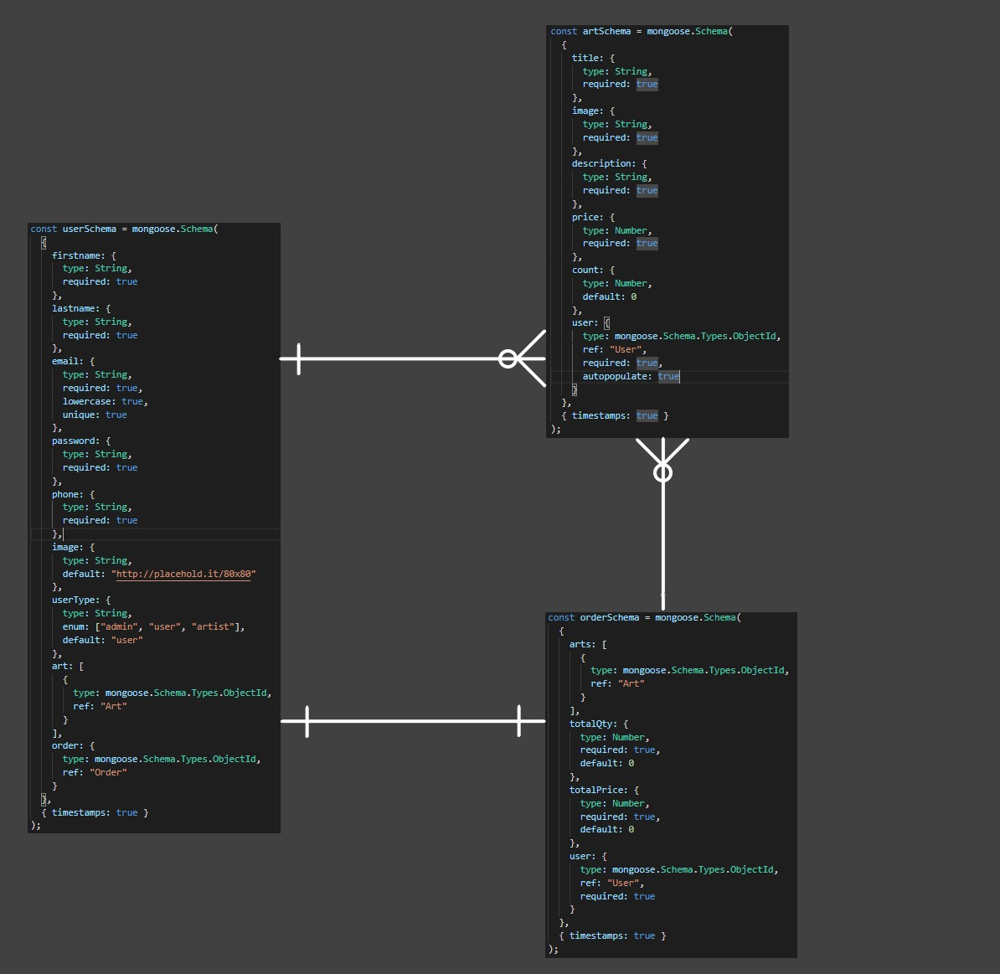
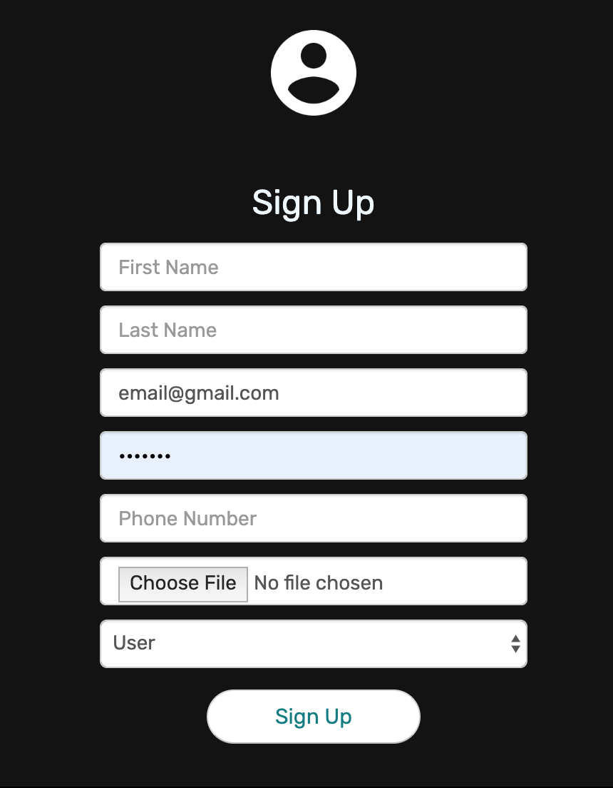
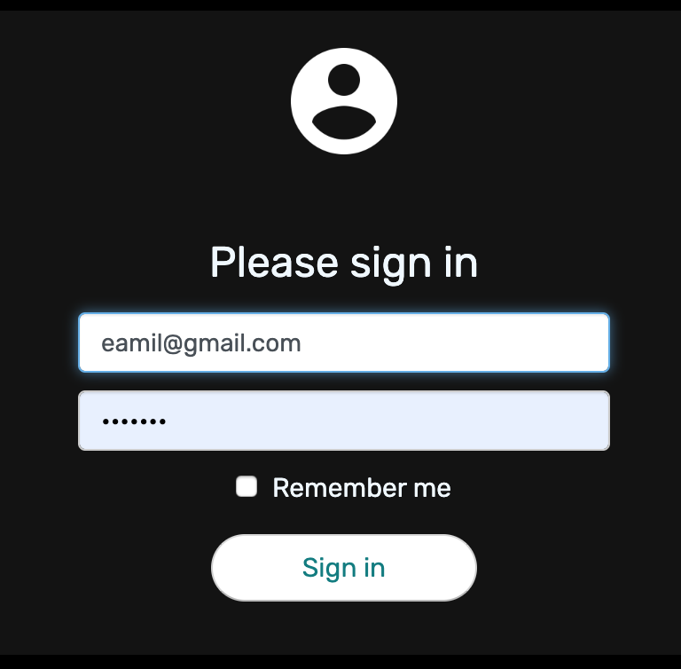
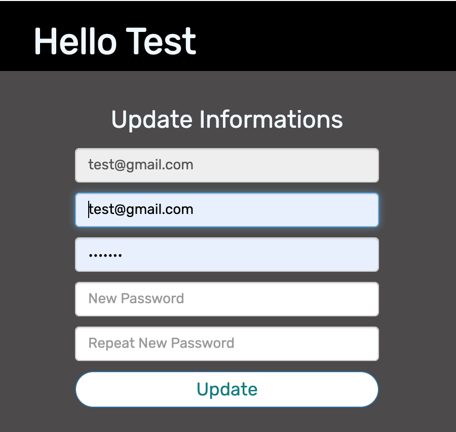
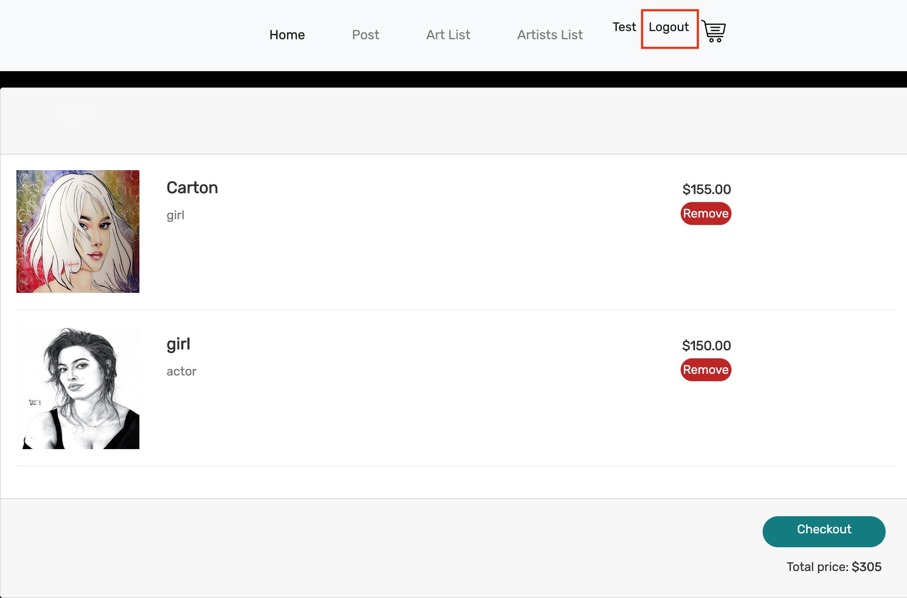
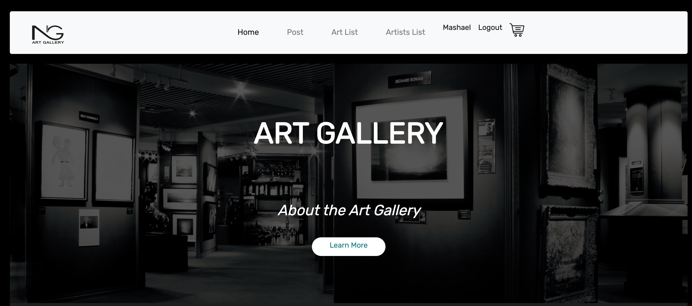
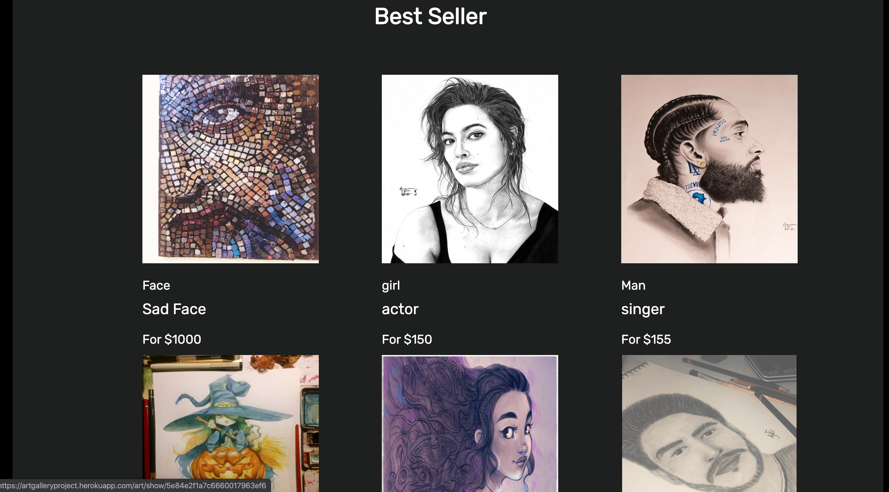
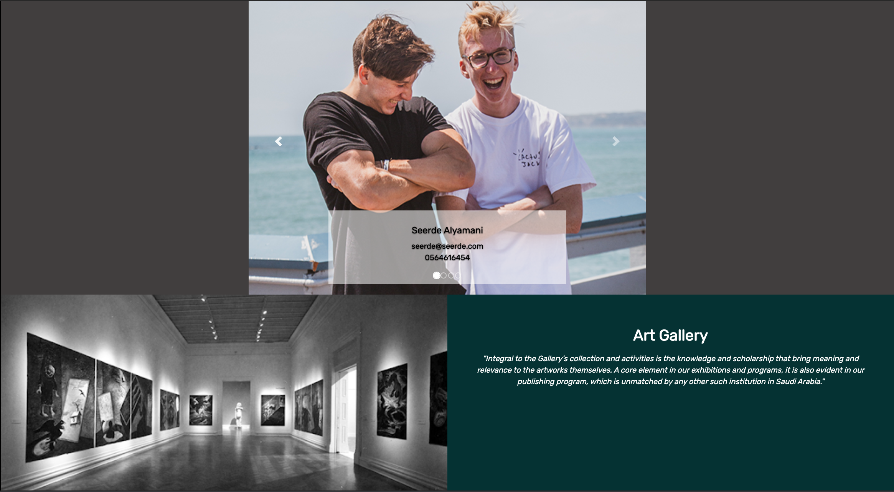

#  

# Project #2: Art gallery App

we are creating a full stack application using NodeJS and NoSQL.

---

## What we de

By the time we submit this project, we have covered new ground in, and reviewed, many of the big themes of the course so far:

- **Command Line**
1. creat
2. git installation
3. save
4. commit
5. pull
6. push

- **Web Fundamentals**: Communicate with internet, and how to structure, style, and animate documents within a browser.
- **Browser Applications**: Dive into CSS, to use libraries and frameworks to get lots of style and functionality for free. Such as Bootstrap
- **Databases**: one to many, many to one, and many to many.
# 

- **NodeJS and Express**: A web-application framework to create database-backed web applications.
- **Mongodb**: Use to database program.
- **Mongoose**: Provides a schema-based solution for object modeling with Node.js to model your Mongodb data.
---

## Requirs

### General Requirs

- Build a web application from scratch, our own work.
- We use Express framework to build your application
- Share on Heroku so application is live on the web [here](https://artgalleryproject.herokuapp.com/auth/signin)

### Technical Requirs

#### Authentication
-  sign up 
# 
-  sign in
# 
-  change password
# 
-  sign out
# 

#### 2 extra resources 
- User able to create a resource
- User able to edit a resource
- User able to view all resources they created
- User able to view a single resource they created
- User not be able to edit or delete other users' resources

#### Stretch Technical 

- Application responsive
- Users able to upload image files 
- Use a CSS library like [Bootstrap](https://www.npmjs.com/package/bootstrap)

# 
# 
# 